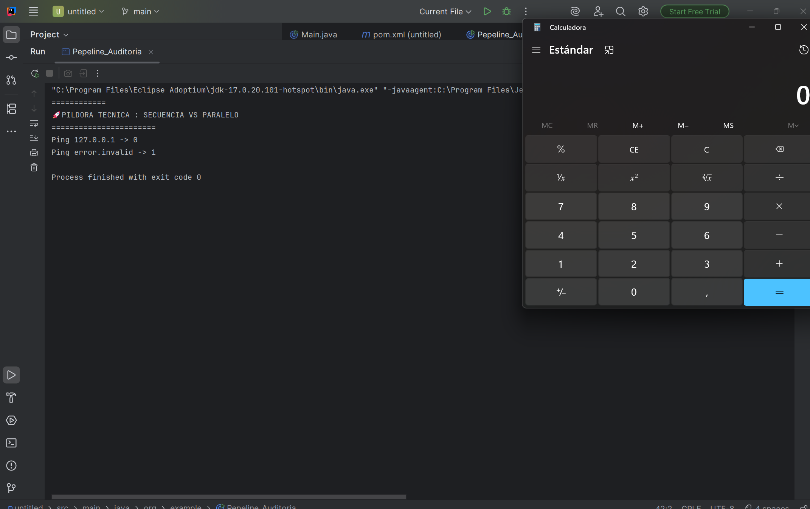

# Reto 2 · Pipeline de Auditoría UDITversum (Fase 1)

**Módulo:** 0490 · Programación de Servicios y Procesos
**Autor:** Lucas Hernandez Romero
**Tecnología:** Java 17 + ProcessBuilder (procesos del sistema operativo)
**RA vinculado:** RA1 · Programación de aplicaciones compuestas por varios procesos


---

## 📺 Qué es esta app

Un programa de consola que simula la primera fase de una auditoría de UDITversum. El programa:

1. Lanza dos comprobaciones (`ping`) a la vez, cada una en su propio proceso del sistema operativo (`127.0.0.1` y `error.invalid`).
2. Espera a que ambas terminen.
3. Lee el código de salida de cada una.
4. Según el resultado combinado, abre una aplicación del sistema: **Bloc de Notas** si los dos pings van bien, **Calculadora** en cualquier otro caso.

```
        ┌──────────────┐
        │  Mi programa │
        │   (Java)     │
        └──────┬───────┘
               │ start()          start()
        ┌──────┴──────┐    ┌──────┴──────┐
        ▼                         ▼
  ┌──────────────┐        ┌──────────────────┐
  │ ping 127.0.0.1│       │ ping error.invalid│  ← corren a la vez
  └─────┬────────┘        └─────┬────────────┘
        │ waitFor()             │ waitFor()
        └───────────┬───────────┘
                    ▼
        ¿codigo1 == 0 && codigo2 == 0?
                    │
        ┌───────────┴───────────┐
        ▼                       ▼
   Bloc de Notas            Calculadora
     (sí)                      (no)
```



Salida real de mi ejecución:

```
Ping 127.0.0.1 -> 0
Ping error.invalid -> 1
```
Como un ping falló, se abre la **Calculadora**.

---

## 🧠 Antes de empezar: planifico

✍️ Esta sección se rellena con lo que pensabas **antes** de programar. Si no la escribiste entonces, sé honesto y apunta lo que recuerdes.

- Con mis palabras, ¿qué me pide el reto? Que lance dos pings a la vez, cada uno en su propio proceso, que espere a que los dos terminen y mire cómo ha acabado cada uno. Según el resultado, el programa decide solo qué aplicación abre: el Bloc de Notas si los dos van bien y la Calculadora si no.
- ¿Qué parte del Reto 1 voy a reutilizar tal cual? La creación de los procesos con ProcessBuilder.
- ¿Qué es nuevo respecto al Reto 1 y me da más respeto? Abrir el Bloc de Notas o la Calculadora según el resultado de los dos pings.
- Mi plan en 4-5 pasos, en orden:
  1. Crear los dos procesos con ProcessBuilder (un ping a 127.0.0.1 y otro a una dirección que no existe).
  2. Lanzar los dos con start(), uno detrás de otro, sin esperar a ninguno.
  3. Esperar a los dos con waitFor() y guardar el código de salida de cada uno.
  4. Decidir con un if y && si los dos códigos son 0.
  5. Abrir notepad.exe si los dos van bien o calc.exe si no, con try/catch por si algo falla.
### Predicciones

| Escenario | ¿Qué código de salida espero en cada ping? | ¿Qué aplicación se abre? |
|---|---|---|
| Los dos pings a 127.0.0.1 | 0 y 0 | Bloc de Notas |
| Un ping válido y otro a una dirección inexistente | 0 en el válido y distinto de 0 en el inexistente | Calculadora |
| Los dos pings a direcciones inexistentes | distinto de 0 en los dos | Calculadora |

**Predicción de tiempo:** si cada ping tarda unos 3 segundos, mi programa tardará unos 3 segundos en total en paralelo, porque los dos procesos corren a la vez y solo espero al más lento. Si los lanzara uno detrás de otro tardaría unos 6 segundos, porque sumaría lo que tarda cada uno.

---

## 🎯 Objetivo del reto

Dar el salto de gestionar un proceso tras otro (Reto 1) a coordinar varios procesos simultáneos, aplicando:

- Creación de procesos con `ProcessBuilder` y `start()`.
- Ejecución concurrente: lanzar ambos procesos antes de esperar a ninguno.
- Sincronización con `waitFor()` y lectura del código de salida.
- Lógica condicional (`if` con `&&` / `||`) para decidir en función de varios resultados.
- Gestión de errores con `try/catch` (`IOException`, `InterruptedException`).

---

## 🛠️ Componentes y conceptos utilizados


| Componente / concepto | Para qué se usa en esta app | Con mis palabras |
|---|---|---|
| `ProcessBuilder` | Prepara la orden que se enviará al sistema operativo (`ping`, `notepad.exe`, `calc.exe`) | Es como escribir la orden en una "ficha" antes de ejecutarla; todavía no se ejecuta nada. |
| `start()` | Lanza de verdad el proceso y devuelve el control enseguida, sin esperar | Arranca el proceso y mi programa sigue con la siguiente línea sin esperar a que acabe. |
| `Process` | Objeto con el que controlo cada proceso ya en marcha | Es el "mando" (`p1`, `p2`) para esperar al proceso y pedirle su resultado. |
| `waitFor()` | Bloquea mi programa hasta que ese proceso termina y devuelve su código de salida | Mi programa se queda parado hasta que ese proceso termine y me da su número final. |
| Código de salida (`int`) | Dice cómo terminó el proceso: 0 = éxito, distinto de 0 = fallo | 0 es "todo bien"; cualquier otro número indica que algo falló. |
| `&&` (AND) | Se cumple solo si las dos condiciones son verdaderas | Los dos pings tienen que valer 0 a la vez. |
| `\|\|` (OR) | Se cumple si al menos una condición es verdadera | (No lo uso en mi código, pero bastaría que uno valiera 0.) |
| `try/catch` | Captura errores que Java no puede evitar (el SO no encuentra el programa, etc.) | Evita que el programa se rompa si algo del sistema falla. |
| `InterruptedException` | Excepción que obliga a gestionar `waitFor()` por si el hilo es interrumpido | `waitFor()` puede ser interrumpido mientras espera, y Java me obliga a controlarlo. |
| `redirectOutput(DISCARD)` + `redirectErrorStream(true)` | Descarta lo que escribe el ping para que no se acumule ni me bloquee | No me interesa el texto del ping, solo su código de salida. |

**¿Cómo se llaman mis dos objetos `Process` y qué lanza cada uno?**
`p1` lanza `ping -n 2 127.0.0.1` (mi propio equipo, debería ir bien) y `p2` lanza `ping -n 2 error.invalid` (una dirección que no existe, debería fallar).

---

## 🔀 Secuencial vs paralelo: el corazón de este reto

Suponiendo que cada ping tarda 3 s:

**❌ Secuencial** (`waitFor()` antes del segundo `start()`): total ≈ 6 s.
**✅ Paralelo** (los dos `start()` primero, los `waitFor()` después): total ≈ 3 s.

**Mi orden real de llamadas, copiado de mi código:**

```java
Process p1 = pb1.start();
Process p2 = pb2.start();

int codigo1 = p1.waitFor();
int codigo2 = p2.waitFor();
```

Los dos `start()` van antes que cualquier `waitFor()`, así que los dos pings están corriendo a la vez.

---

## 🔢 Tabla de verdad de mi decisión

Condición de mi código: `codigo1 == 0 && codigo2 == 0`

| Código ping A | Código ping B | ¿Ping A OK? | ¿Ping B OK? | Condición (&&) | Aplicación que abro |
|---|---|---|---|---|---|
| 0 | 0 | Sí | Sí | verdadera | Bloc de Notas |
| 0 | ≠ 0 | Sí | No | falsa | Calculadora |
| ≠ 0 | 0 | No | Sí | falsa | Calculadora |
| ≠ 0 | ≠ 0 | No | No | falsa | Calculadora |

**¿Cambiaría el resultado de alguna fila si cambiara `&&` por `||`?**
Sí, las filas 2 y 3 (un ping bien y otro mal): con `||` la condición sería verdadera y se abriría el Bloc de Notas en vez de la Calculadora. Las filas 1 y 4 no cambian.

---

## 🚀 Cómo ejecutar el proyecto

1. Clonar o abrir el proyecto en IntelliJ IDEA.
2. Esperar a que indexe el proyecto.
3. Ejecutar (▶) la clase principal `Pepeline_Auditoria`.

⚠️ **Dependencia del sistema operativo:** `ping` usa `-n` en Windows y `-c` en Linux/Mac, y `notepad.exe` / `calc.exe` solo existen en Windows. **Probado en Windows 11 con IntelliJ IDEA 2025.2.2 y JDK 17 (Eclipse Adoptium).**

---

## 🔍 Mientras programo: mi diario de decisiones

✍️ Anota solo lo que de verdad te pasó (aunque sean 2 o 3 entradas).

| Qué intentaba | Qué pasó realmente | Qué hice / qué aprendí |
|---|---|---|
| crear procesos | los cree | a crearlos |
| correr simultaniamente los dos | no lo hice simultaniamente | lo mire del proyecto pasado y aprendi a hacerlo |

**Mi pregunta-brújula cuando me bloqueo:**
1. ¿Qué espero que haga esta línea?
2. ¿Qué está haciendo realmente? (imprimo valores para comprobarlo)
3. ¿En qué punto exacto se separan las dos respuestas?

---

## 🧠 Análisis técnico (preparación para la defensa)


### 1. Secuencial vs paralelo
Las líneas que garantizan que los dos pings se ejecutan a la vez son `Process p1 = pb1.start();` y `Process p2 = pb2.start();`, seguidas **antes** de cualquier `waitFor()`. `start()` no espera: el sistema operativo ejecuta el ping y mi programa sigue. Si pusiera `p1.waitFor()` justo antes de `pb2.start()`, mi programa se pararía hasta que acabase el primer ping y solo entonces lanzaría el segundo: habría un solo proceso a la vez y el tiempo total sería la suma de los dos.

### 2. El código de salida (exit code)
`waitFor()` devuelve un `int`. Por convención de los sistemas operativos, 0 significa que el proceso terminó bien y cualquier otro valor indica un fallo; los distintos de 0 permiten distinguir tipos de error. En mi ejecución, `127.0.0.1` devolvió 0 y `error.invalid` devolvió 1. No es lo mismo que "el ping falle" (el programa se ejecuta y devuelve un número ≠ 0) que "el programa ping no pueda ejecutarse" (eso lanza `IOException`).

### 3. Lógica condicional
```java
if (codigo1 == 0 && codigo2 == 0) {
    new ProcessBuilder("notepad.exe").start();
} else {
    new ProcessBuilder("calc.exe").start();
}
```
Uso `&&` porque la auditoría solo se considera correcta si **las dos** comprobaciones pasan. Si falla cualquiera (o las dos), se abre la Calculadora. Con `||` cambiarían las filas en las que solo uno de los pings falla.

### 4. Gestión de excepciones
Entraría en el `catch (IOException e)` si Java no consigue ni arrancar el proceso: por ejemplo, si escribo mal el ejecutable (`notepd.exe`) o ejecuto el programa en Linux/Mac, donde `notepad.exe` y `calc.exe` no existen. Es distinto de que el ping falle: ahí el proceso sí arranca y simplemente devuelve un código ≠ 0. `InterruptedException` salta si el hilo se interrumpe mientras espera en `waitFor()`; por eso restauro la marca con `Thread.currentThread().interrupt()`.

---

## 🛡️ Preparación para la defensa: ¿sabría hacer esto en directo?

✍️ Marca solo las que ya sabes hacer sin ayuda:

- si Cambiar la condición para que se abra la Calculadora solo si falla uno de los dos pings.
- si Añadir un tercer ping en paralelo y que la decisión dependa de los tres.
- si Mostrar el PID de cada proceso al lanzarlo.
- si Medir y mostrar cuántos milisegundos tarda en total el programa.
- si Hacer que el programa funcione en Linux (cambiar `-n` por `-c` y las apps a abrir).
- si Provocar a propósito una `IOException` y mostrar un mensaje claro al usuario.
- si Explicar qué pasaría si quito el `waitFor()`.

**¿Cuál me costó más y por qué?** ✍️

---

## 🧭 Del Reto 1 al Reto 2: cómo di el salto

- ¿Qué hacía mi Reto 1 que aquí ya no me sirve tal cual? el If
- ¿Qué he tenido que cambiar para que dos procesos corran simultáneamente? el "2" dentro del processBuilder
- ¿Qué ventaja tiene lanzar en paralelo? ¿Y qué problema nuevo aparece cuando dependo de dos resultados a la vez? La ventaja es el tiempo. En paralelo el programa tarda lo que tarda el ping más lento, y en secuencial tardaría la suma de los dos. Además, mientras un proceso espera respuesta de la red, el otro ya está trabajando.
- Si mañana el pipeline tuviera 50 comprobaciones en lugar de 2, ¿seguiría teniendo sentido mi estructura? ¿Qué cambiaría? No, porque no tiene sentido crear pb1, pb2, … pb50 a mano, y una condición con 50 && sería inmanejable. Cambiaría tres cosas

---

## 🧠 Qué he aprendido

✍️ Completar al terminar, con tus palabras: A como lanzar una aplicacion con Procesos

- `start()` vs `waitFor()`: lanzar un proceso y esperarle son cosas distintas porque…
- Paralelismo real: dos procesos corren "a la vez" porque…
- Código de salida: que sea 0 o distinto de 0 significa…
- `&&` vs `||`: elegí el operador que elegí porque…
- `IOException` vs ping fallido: la diferencia entre ambos es…
- Fiabilidad de mi decisión: lo que mi programa decide se basa en… (¿es fiable? ¿en qué casos podría equivocarse?)

---

## 🐞 Dificultades y cómo las resolví

✍️ Dificultad 1: Crear los procesos
- Qué síntoma vi: 
- Cuál era la causa real:
- Cómo la encontré:
- Cómo evitaré que me vuelva a pasar: Centrandome ms

---

## 🪞 Autoevaluación

✍️ Marca con honestidad:

| Puedo explicar a un compañero… | 🔴 No | 🟡 Más o menos | 🟢 Sí |
|---|---|---|---|
| Qué hace ProcessBuilder | ☐ | ☐ | 🟢 |
| Por qué start() no espera | ☐ | ☐ |🟢 |
| Qué línea hace que mis procesos sean paralelos | ☐ | 🟡 | ☐ |
| Qué pasaría si moviera el waitFor() | ☐ | ☐ | 🟢 |
| Qué devuelve waitFor() y qué significa 0 | ☐ | 🟡 | ☐ |
| Por qué uso && / \|\| en mi condición | ☐ | 🟡 | ☐ |
| Cuándo se entra en el catch de IOException | ☐ | ☐ | 🟢|

- Mis predicciones del principio, ¿acerté?: si 
- Lo que haría diferente si empezara de nuevo: copiaria y pegaria el proyecto anterior
- Lo que todavía no tengo claro y quiero preguntar en clase: Exlicar mejor el waitFor

---

## 📂 Estructura del proyecto

```
untitled/
├── pom.xml
└── src/main/java/org/example/
    ├── Main.java
    └── Pepeline_Auditoria.java   → clase con el main (el pipeline de auditoría)
README.md                          → este documento
```

## 🔗 Enlace

GitHub: ✍️ (https://github.com/lucas196669/psp_udit/tree/main/reto02_pipeline-auditoria/untitled)